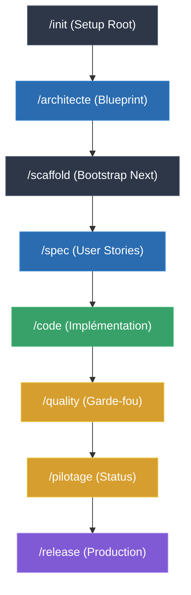

# 🕵️ Système de Gouvernance Antigravity : azpiko

Bienvenue dans l'écosystème de développement de TeeLov. Ce dossier `.agent/` n'est pas une simple documentation, c'est le **Cerveau Opérationnel** qui pilote l'IA pour garantir un logiciel "Zero Defaut" et une expérience premium.

---

## 🏗️ Architecture : Les 9 Meta-Skills
L'expertise de l'Agent est répartie en 9 pôles stratégiques :

1.  **[Premium Conception](./skills/premium-conception/SKILL.md)** : Vision produit, User Stories (SP) et Architecture amont.
2.  **[Premium Engineering](./skills/premium-engineering/SKILL.md)** : Clean Code, Testing rigoureux et Code Review.
3.  **[Premium Experience](./skills/premium-experience/SKILL.md)** : Design Wahoo, Glassmorphism et Motion Design.
4.  **[Core Infrastructure](./skills/core-infrastructure/SKILL.md)** : Fondations techniques (PWA, Dexie, Next.js Static).
5.  **[Project Governance](./skills/project-governance/SKILL.md)** : Reporting, Vélocité et Pilotage automatique.
6.  **[Scientific Debugging](./skills/scientific-debugging/SKILL.md)** : Méthode d'investigation rigoureuse des incidents.
7.  **[Blueprint Site](./skills/blueprint-site/SKILL.md)** : Archetype pour Landing Pages & Vitrines.
8.  **[Blueprint PWA](./skills/blueprint-pwa/SKILL.md)** : Archetype pour Applications Mobiles Offline-First.
9.  **[Blueprint SAAS](./skills/blueprint-saas/SKILL.md)** : Archetype pour Backoffices & Dashboards.

---

## 🚀 Cas d'Utilisation Opérationnels

### 1. Création d'une App PWA from scratch
*Objectif : Initialiser un nouveau projet mobile-first avec gestion du offline.*
1.  **Init** : `/init` pour créer la structure `.docs/` et les scripts de pilotage.
2.  **Vision** : `/product` pour définir les personas et le PRD.
3.  **Archi** : `/architecte` pour recommander le **Blueprint PWA**.
4.  **Scaffold** : `/scaffold` pour lancer `create-next-app`, épurer la boilerplate et setup Dexie/SW.

### 2. Ajout d'une fonctionnalité (Sans impact archi)
*Objectif : Implémenter une nouvelle US sans modifier les fondations techniques.*
1.  **Spec** : `/spec` pour rédiger l'User Story et l'estimer en Story Points (SP).
2.  **Code** : `/code` pour générer le code source, les tests et passer la pipeline `quality`.

### 3. Analyse post-code (État de Santé)
*Objectif : Connaître la qualité et l'avancement du projet après une session de dev.*
1.  **Cockpit** : Lancer `npm run cockpit` pour synchroniser métriques, vélocité et backlog.
2.  **Pilotage** : `/pilotage` pour générer le Dashboard visuel et vérifier les KPIs de santé.

### 4. Debugging à chaud (Hot Debug)
*Objectif : Résoudre un incident de production de manière scientifique.*
1.  **Investiguer** : `/debug` pour isoler le bug. L'agent suit la méthode **scientific-debugging** (Reproduction -> Hypothèse -> Test de falsification).
2.  **Fix** : Appliquer le correctif minimal et immortaliser la solution par un test de non-régression.

### 5. Fabriquer la Release
*Objectif : Livrer une version stable, incrémenter le versioning et archiver les rapports.*
1.  **Release** : `/release` pour automatiser la chaîne : Quality -> Bump Version (SemVer) -> Build Statis -> Archivage des Audits.

---

## 💡 Cartographie des Flux

> [!TIP]
> **Règle d'or :** L'agent commence toujours par `/architecte` avant tout scaffolding pour garantir que le Blueprint choisi est le bon.
